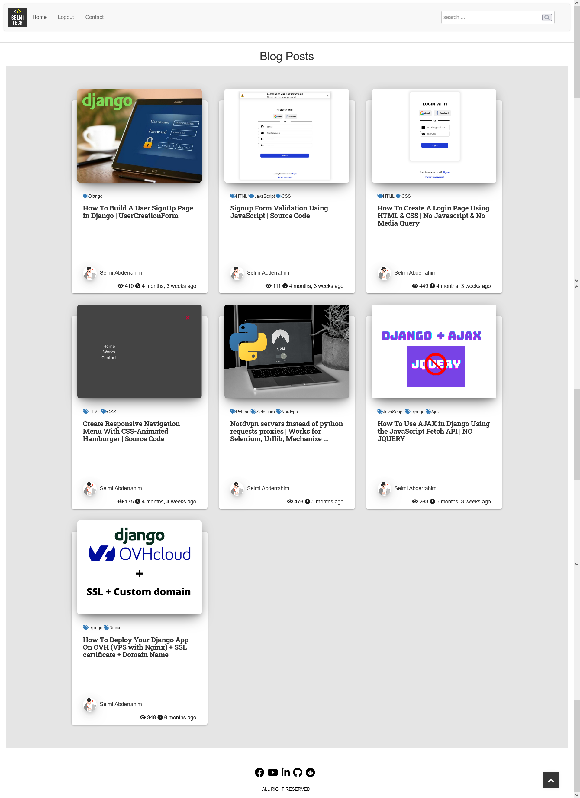
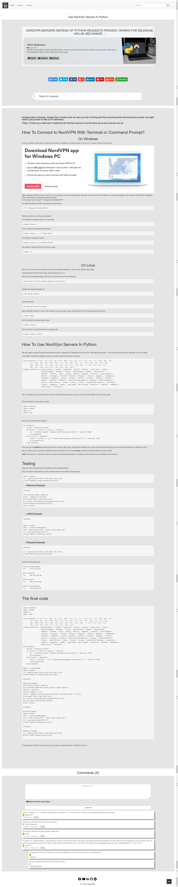
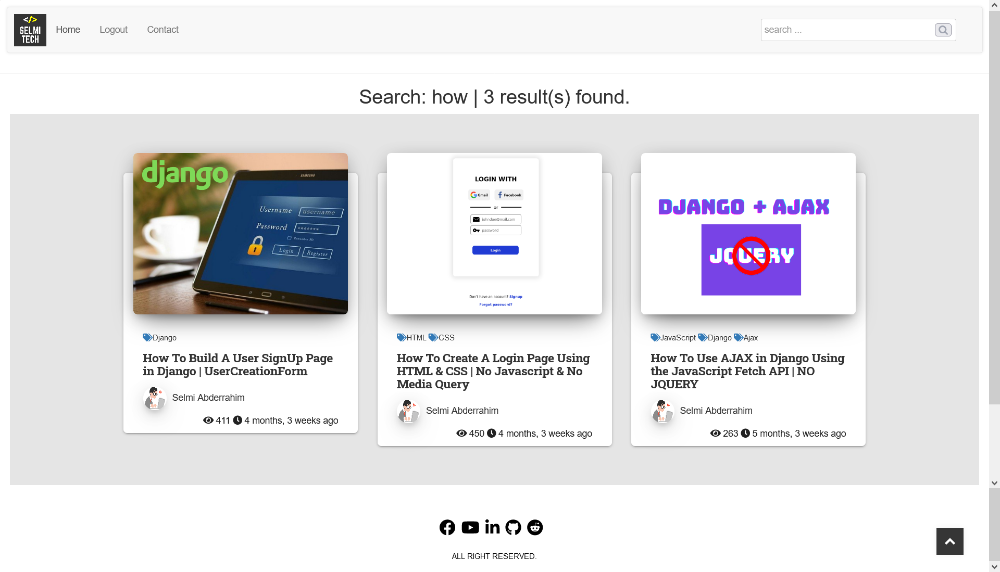
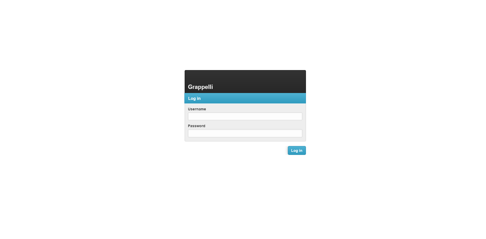

# Blog website built with Bootstrap 3 and Django 3.2

## Features

- **dynamic**: The form validation and some other parts are dynamic, handled by AJAX. so it gives a better using experince by avoiding page refresh on each request.

- **maillist**: You can configure the .env file, add your mailchimp key and you'll be able to collect email from logged in users.

- **login required**: The visitor must login to read the post content or to reply or post a comment.

- **lightweight**: This blog is very basic and simple, thanks to its size, it's super fast.

- **notify users**: Users can receive updates on their posts, comments, or replies via email.

## How to install

Like any other Django project, you need first to create a virtual environment, install packages then run the server.

```
pip install virtualenv
virtualenv env
env\Scripts\activate
pip install -r requirements.txt
python manage.py runserver
```

But make sure to update the .env file with your data.
```
SECRET_KEY=django-insecure-^57sdu8tlw$q^_3@o@@u^(*q_!**s+miy**f3j!&#9rq*q-md7
EMAIL_PASSWORD=put_your_email_password_here
EMAIL_ADDRESS=put_your_email_address_here
MAILCHIMP_API_KEY=put_your_mailchimp_key
MAILCHIMP_EMAIL_LIST_ID=put_your_email_list_id_of_mailchimp
```


## Screenshots



---



---



---



---

# contact me: selmitech@gmail.com